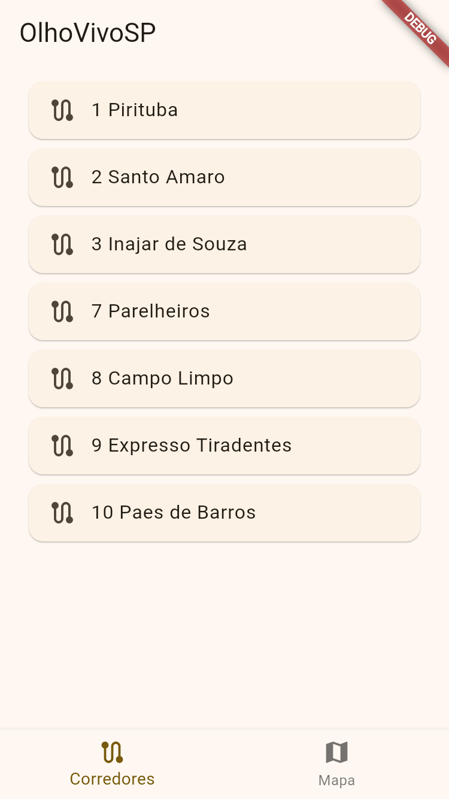

# Olho Vivo SP  

Aplicativo desenvolvido em Flutter para facilitar a mobilidade urbana em São Paulo, fornecendo informações em tempo real sobre o transporte público.  

## Funcionalidades  

- **Busca por corredores**: Localize corredores de ônibus disponíveis na cidade.  
- **Previsão de chegada de ônibus**: Consulte a previsão em tempo real para a chegada do próximo ônibus.  
- **Pontos de parada**: Encontre paradas de ônibus próximas ou específicas.  

## Tecnologias Utilizadas  

- **Flutter**: Framework utilizado para desenvolvimento multiplataforma.  
- **API Olho Vivo (Proxy da Aiko)**: Conexão com o serviço via [API](https://aiko-olhovivo-proxy.aikodigital.io) para acesso aos dados de transporte público.

## Como Executar  

1. Clone o repositório:  

    ```bash
    git clone
    ```
  
2. Navegue até o diretório do projeto:  

    ```bash
    cd olho_vivo_sp
    ```

3. Instale as dependências:

    ```bash
    flutter pub get
    ```

4. Execute o aplicativo:
  
    ```bash
    flutter run
    ```
  
## Demonstração





Desenvolvido com ♥ por Tiago Rodrigues Sousa.
